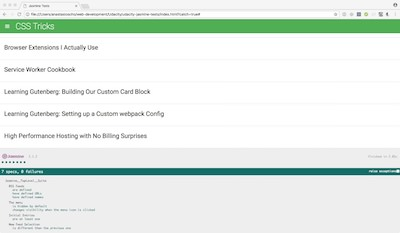

# Jasmine Tests

I created this website for the purposes of the [Udacity's Front-End Web Developer Nanodegree Program](https://www.udacity.com/course/front-end-web-developer-nanodegree--nd001) to showcase my JavaScript testing skills using the [Jasmine](https://jasmine.github.io/) framework.

## How to Load the website

- Clone the **[repo](https://github.com/anastasioscho/udacity-jasmine-tests.git)** and open index.html.

## Screenshots

